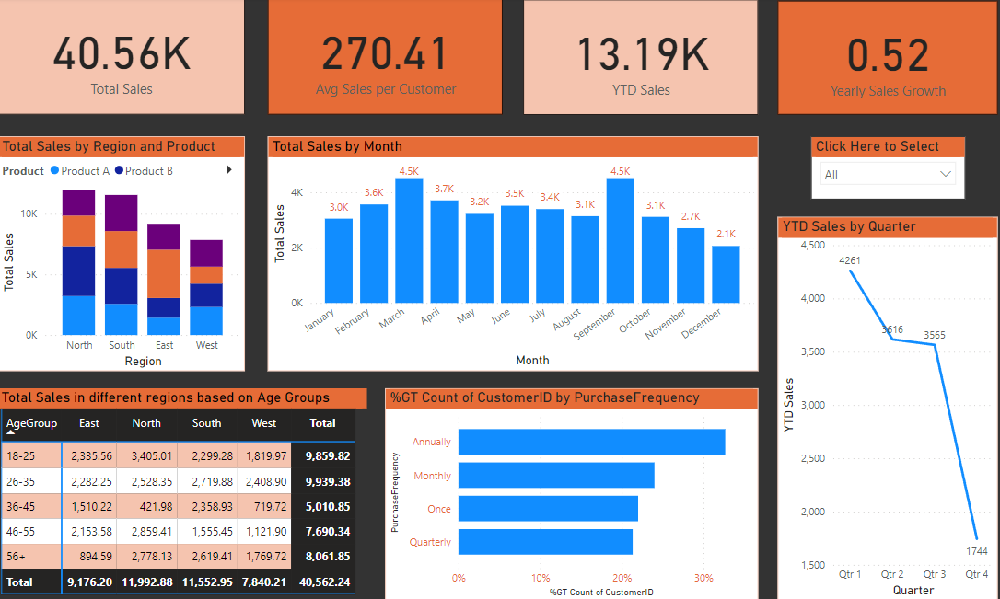
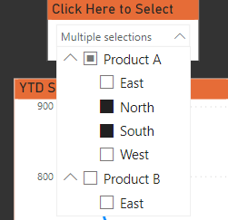

# Sales and Customer Segmentation Dashboard

## Overview
This repository contains a comprehensive Power BI dashboard designed to provide insights into sales performance and customer segmentation. This interactive dashboard allows users to analyze sales trends, customer demographics, and purchasing behaviors to support data-driven decisions.

## Objective
The goal of this project is to showcase essential metrics, such as total sales, customer count, and product performance by region, while also allowing users to slice and filter data interactively. The dashboard helps stakeholders quickly identify top-performing products, high-value customer segments, and seasonal sales trends.

## Data and Techniques Used

- **Data Source**: Sample sales and customer data, including fields for customer demographics, purchase date, product details, and sales amounts.
- **Power BI Features**:
   - **DAX Calculations**: Used to create dynamic measures, such as Total Sales, Yearly Sales Growth, and YTD Sales.
   - **Power Query Editor**: For initial data transformations and cleansing.
   - **Visualizations**: A variety of visual types, including KPI Cards, Matrix, Stacked Column Charts, Line Charts, and a Slicer.

## Dashboard Layout and Components

- **Row 1 (KPI Cards)**:
  - **Total Sales**: Displays the total sales amount.
  - **Average Sales per Customer**: Shows the average purchase amount per customer.
  - **YTD Sales**: Year-to-Date sales, comparing to the current year’s beginning.
  - **Yearly Sales Growth**: Percentage growth in total sales compared to the previous year.

- **Row 2 (Charts and Slicer)**:
  - **Total Sales by Region and Product** 
  (Stacked Column Chart): Compares product sales across different 
  regions.
  - **Total Sales by Month** (Line and Stacked Column Chart): 
  Shows monthly sales trends.
  - **Slicer**: A dropdown to filter data by 
  Region and Product.

- **Row 3 (Additional Analysis)**:
  - **Total Sales by Region and Age Group** (Matrix Chart): Sales breakdown across regions and customer age groups.
  - **%GT Count of CustomerID by Purchase Frequency** (Clustered Bar Chart): Displays the proportion of repeat purchases.
  - **YTD Sales by Quarter** (Line Chart): Shows sales growth across each quarter.

## Measures and Calculations
Custom DAX measures created in the project:

- **Total Sales**: Calculates the sum of all sales transactions.
    ```DAX
    Total Sales = SUM(Sales[SalesAmount])
    ```

- **Average Sales per Customer**: Computes the average transaction amount per customer.
    ```DAX
    Average Sales per Customer = 
    DIVIDE([Total Sales], DISTINCTCOUNT(Sales[CustomerID]), 0)
    ```

- **Yearly Sales**: Sum of sales for the current year.
    ```DAX
    Yearly Sales = 
    CALCULATE([Total Sales], YEAR(Sales[PurchaseDate]) = YEAR(TODAY()))
    ```

- **Yearly Sales Growth**: Calculates the year-over-year percentage growth.
    ```DAX
    Yearly Sales Growth = 
    DIVIDE(
        [Total Sales] - CALCULATE([Total Sales], DATEADD(Sales[PurchaseDate], -1, YEAR)), 
        CALCULATE([Total Sales], DATEADD(Sales[PurchaseDate], -1, YEAR)), 
        0
    )
    ```

- **YTD Sales**: Year-to-Date sales measure.
    ```DAX
    YTD Sales = 
    TOTALYTD([Total Sales], Sales[PurchaseDate])
    ```


## Usage and Navigation
This Power BI dashboard is designed for easy interaction:
- Use the slicer to filter the data by Region and Product, which updates the entire dashboard.
- Analyze KPI cards for a quick overview of sales and customer statistics.
- Explore the detailed charts to observe trends, product performance, and customer segmentation.

## Conclusion and Insights
This dashboard provides actionable insights for sales teams and business stakeholders:
- **High Sales Regions**: Identify top regions contributing to sales.
- **Product Preferences**: Understand which products are most popular across customer segments.
- **Demographic Trends**: Examine customer age groups and purchase patterns to refine marketing strategies.

## Technologies Used
- **Power BI**: Leveraged for data visualization, DAX calculations, and Power Query transformations.

## How to Use This Project

To effectively utilize the Sales and Customer Segmentation Dashboard, follow these steps:

1. **Clone the Repository**:  
   If you haven't already, clone the repository to your local machine using the following command:  
   ```bash
   git clone https://github.com/yourusername/Sales-and-Customer-Segmentation-Dashboard.git
   ```  
   Replace `yourusername` with your GitHub username.

2. **Open Power BI Desktop**:  
   Ensure you have Power BI Desktop installed on your machine. If not, download it from the [official Microsoft website](https://powerbi.microsoft.com/desktop/).

3. **Open the Power BI File**:  
   Navigate to the directory where you cloned the repository and open the `.pbix` file:  
   ```plaintext
   Sales-and-Customer-Segmentation-Dashboard/yourfile.pbix
   ```  
   Replace `yourfile.pbix` with the actual name of your Power BI file.

4. **Explore the Dashboard**:  
   Once the file is open, you will see an interactive dashboard featuring various visualizations. You can filter data using the slicers provided and explore insights on sales and customer segmentation.

5. **Data Refresh**:  
   If you want to update the data in the dashboard, click on the "Refresh" button in Power BI to pull the latest data from the underlying data model.

6. **Customization**:  
   Feel free to customize the dashboard as needed. You can modify the visualizations, add new metrics, or change the layout to better suit your analysis requirements.

7. **Save Your Changes**:  
   After making any modifications, remember to save your changes by clicking on the "Save" icon in Power BI Desktop.

---
